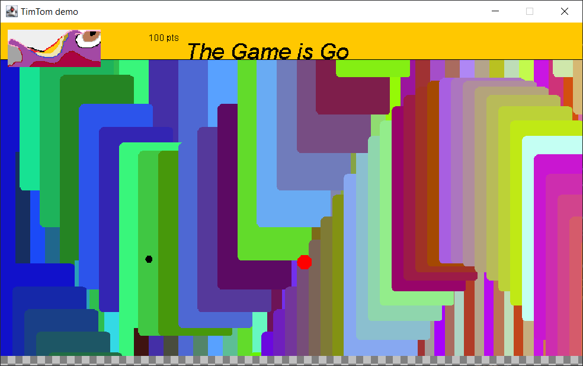

TimTom
-
2D game engine with physics implemented in Java using AWT.

Screenshot featuring two instances of BouncingBall.

Future
-
The performance will be satisfactory after implementing multithreading.
